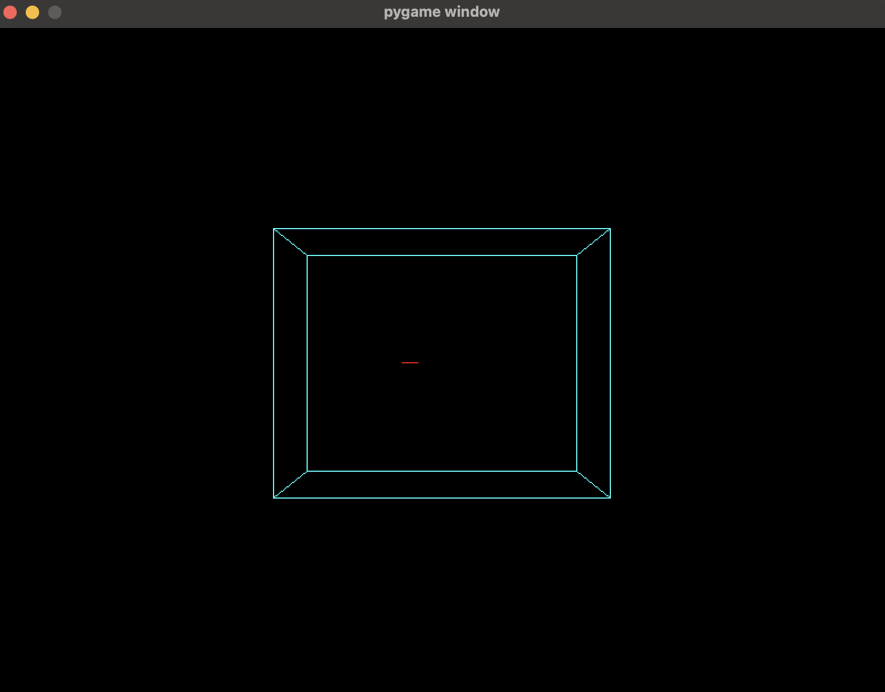

# 3D Line Clipping with Cyrus-Beck Algorithm

This project implements the Cyrus-Beck algorithm for 3D line clipping against a rectangular prism (5 cm × 4 cm × 3 cm) using Python and OpenGL. It visualizes the prism (cyan wireframe), the original line (red), and the clipped line (blue).

## What is the Cyrus-Beck Algorithm?
The Cyrus-Beck algorithm clips a line against a convex volume (here, a prism) in 3D. It:
1. Represents the line parametrically: \(P(t) = P_0 + t \cdot (P_1 - P_0)\).
2. Computes intersections with the prism’s planes (left, right, bottom, top, near, far).
3. Finds the largest entering and smallest exiting intersection points to determine the clipped segment.

## Implementation
The algorithm is implemented in `src/clipping.py`:
- The `cyrus_beck_3d` function clips a line against the prism by calculating intersection parameters \(t\) for each plane.
- For the sample line from \((2, 2, -2)\) to \((2, 2, 5)\), it clips to \((2, 2, 0)\) to \((2, 2, 3)\).
- The result is visualized using OpenGL, with rendering handled in `src/rendering.py`.

## Folder Structure

- **`clipping.py`**: Implements the Cyrus-Beck algorithm.
- **`rendering.py`**: Handles OpenGL rendering.
- **`main.py`**: Runs the application, defining the prism and sample line.
- **`requirements.txt`**: Lists dependencies.

## Setup
Clone the repo:
   ```bash
   git clone <repository-url>
   
   cd Cyrus-Beck-Algorithm-for-3D-clipping
  
   ```
python environment set up

```bash
python -m venv venv
pip install -r requirements.txt
python main.py
```

## Screenshot
